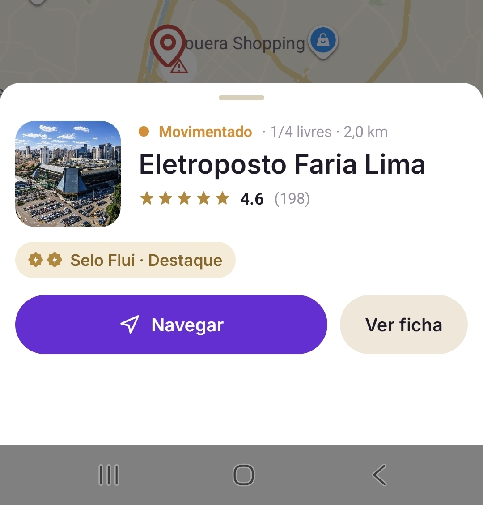
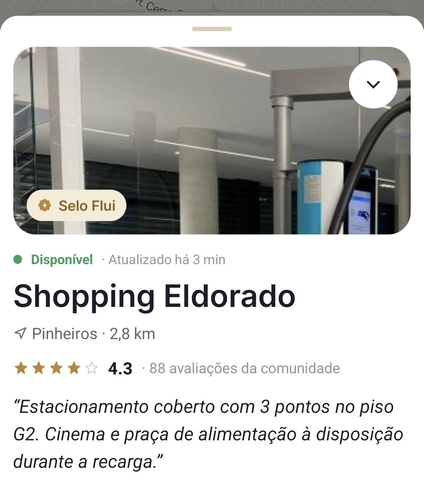
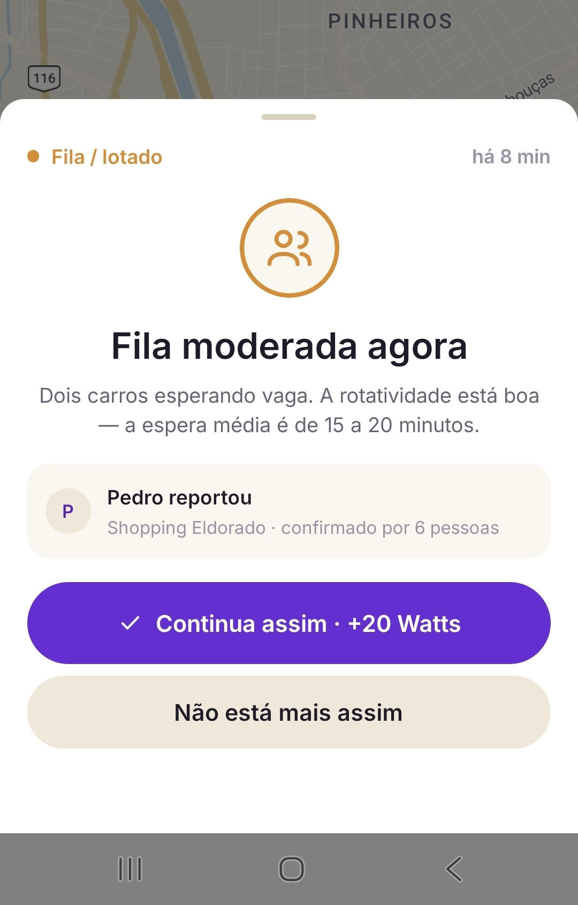

# ⚡ Rota by Flui

**Encontre, avalie e planeje suas recargas — feito por e para motoristas de veículos elétricos.**


Projeto acadêmico desenvolvido para o **Enterprise Challenge (FIAP)** — Etapa 2. A Etapa 1 propôs a experiência em um protótipo navegável no Figma; esta etapa transforma essa proposta em um **aplicativo mobile real e funcional**, construído em React Native.

---

## 🚗 Sobre o projeto

Motoristas de veículos elétricos enfrentam um problema muito específico: não basta encontrar *um* posto de recarga no mapa — é preciso saber se aquele posto está disponível agora, se atende ao carro específico do motorista, e se vale a pena o desvio. O **Rota by Flui** resolve isso reunindo, num só lugar:

- Um **mapa interativo** com status de disponibilidade em tempo real
- Uma **ficha completa** de cada ponto — fotos reais, especificações técnicas, comodidades, avaliações
- Uma **estimativa de recarga calculada para o carro do usuário** (capacidade de bateria, curva de carga, compatibilidade de conector), não um número genérico
- **Roteiros de viagem curados** (Guia Flui) com paradas de recarga já planejadas
- Uma **camada de comunidade** — reportes, avaliações e fotos de outros motoristas mantendo as informações atualizadas
- **Gamificação** (Watts, missões, conquistas) incentivando esse compartilhamento

O app é organizado em quatro áreas, acessadas por navegação em abas: **Mapa · Rota · Comunidade · Perfil**.

## 📱 Capturas de tela

Capturas reais do aplicativo em funcionamento, em dispositivo Android:

<table>
<tr>
<td width="50%">

**Mapa + prévia do ponto**
Toque em um pino para ver disponibilidade, nota e ações rápidas sem sair do mapa.



</td>
<td width="50%">

**Ficha do ponto de recarga**
Foto real, Selo Flui, status, nota da comunidade e um comentário em destaque.



</td>
</tr>
<tr>
<td width="50%">

**Vozes da comunidade**
Feed de avaliações, reportes e fotos enviadas por outros motoristas.


</td>
<td width="50%">

**Reporte em tempo real**
Situações reportadas por outros usuários, confirmadas pela comunidade.



</td>
</tr>
</table>

## ✨ Funcionalidades

| Área | O que tem |
|---|---|
| **Mapa** | Busca por texto, chips de filtro rápido, folha de filtros avançados, alternância mapa/lista, recentralização na localização do usuário |
| **Ficha do ponto** | Foto real, status e disponibilidade (X/Y vagas), Selo Flui, grade de especificações, tempo de carga estimado para o carro do usuário, comodidades, avaliações reais, favoritar/reportar/navegar |
| **Rota** | Planejador com estimativa de bateria na chegada e compatibilidade de conector; Guia Flui com roteiros curados e handoff de navegação (Google Maps / Waze) |
| **Comunidade** | Feed de atividade, avaliações com fotos, reportes (fila, fora do ar, preço, vaga bloqueada), curtidas |
| **Perfil** | Carro selecionado, pontos favoritos, pontuação (Watts), conquistas, tema, configurações de acessibilidade |

## ♿ Acessibilidade

Recurso tratado como requisito funcional, não como polimento final — construído e depois **testado com leitor de tela (TalkBack) em aparelho real**:

- Cartões e grupos de informação lidos como um bloco lógico só, não elemento por elemento
- Mudanças de estado anunciadas em voz alta (curtir, marcar como útil, ajustar bateria)
- Controles com gesto próprio (ex.: barra de bateria) ganham uma alternativa tocável quando um leitor de tela é detectado
- Toda folha deslizante (bottom sheet) tem um botão de fechar alcançável, sem depender só de gesto
- Animações respeitam a preferência "reduzir movimento" do sistema
- Visualização em lista assumida por padrão quando um leitor de tela está ativo

## 🛠️ Tecnologias

- [Expo](https://expo.dev) (SDK 54) + React Native + TypeScript
- [react-native-maps](https://github.com/react-native-maps/react-native-maps) (Google Maps)
- [@gorhom/bottom-sheet](https://gorhom.dev/react-native-bottom-sheet/) para as folhas deslizantes
- [expo-image](https://docs.expo.dev/versions/latest/sdk/image/) para fotografia real
- [Lottie](https://airbnb.io/lottie/) para animações de destaque
- Contextos próprios (React Context + AsyncStorage) para carro, favoritos, pontuação e avaliações — sem backend

## 🚀 Rodando o projeto

```bash
cd mobile
npm install
npx expo start
```

Pressione `a` para Android, `i` para iOS (simulador), ou escaneie o QR code com o app **Expo Go** em um aparelho físico.

> O mapa (`react-native-maps`) precisa de uma build nativa para renderizar o Google Maps no Android — veja `mobile/README.md` para configurar a chave de API. No Expo Go, o app roda normalmente com o provedor de mapa padrão.

Documentação técnica adicional (arquitetura, decisões de porte, plano de Android Auto) está em [`mobile/README.md`](mobile/README.md) e [`mobile/docs/`](mobile/docs/).

## 📂 Estrutura do repositório

```
.
├── mobile/     → o aplicativo React Native (a entrega desta etapa)
├── project/    → protótipo HTML/Figma da Etapa 1 (referência de design)
└── chats/      → histórico de decisões de design da Etapa 1
```

## 👥 Equipe

- Ana Carolina Cantarelli Fernandes — RM 561491
- Sarah Gonçalves Garcia — RM 563539

---

*Projeto acadêmico desenvolvido para o Enterprise Challenge — FIAP.*
